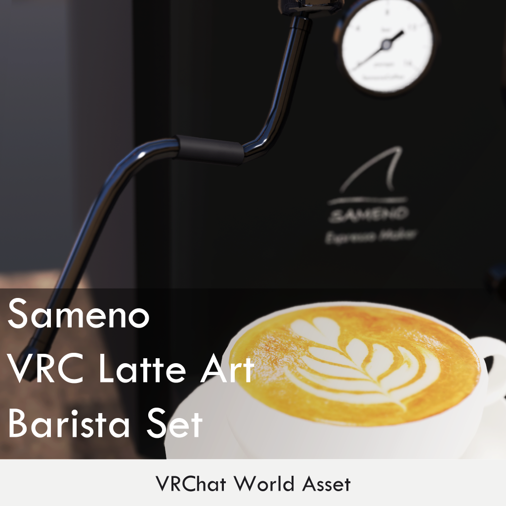

# VRC Latte Art BaristaSet 説明書（Manual）

© 2026 Sameno Works(sumisame) All rights reserved.

https://sameno.booth.pm/items/7656169

Please scroll down for the English version. 

英文での説明は下部にございます。

------

更新履歴 / Release

2026/01/01: Manual v0.1.0 Released. 

# 事前準備

本パッケージを使用する際は、Unity 2022.3.22f1のプロジェクトをご用意ください。

Unity 2019とは互換性がありませんのでご注意ください。

VRCSDKは ver3.10.0以降を必ず使用してください。

本商品はUdonSharp(U#)を使用しています。VCC(VRChat Creator Companion)のWorlds U#でプリインストールされている最新バージョンの U# を使用してください。

VCC経由でインストールされるU#以外のバージョンは動作サポート対象外とさせていただきます。  

本商品はシェーダーにliltoon、および **lilPBR** を使用しています。 

本商品をインストールする前に、以下URLまたはVCCより最新の「liltoon」、「**lilPBR**」の両方をプロジェクトにインポートしてください。

liltoon

https://lilxyzw.booth.pm/items/3087170

# セットアップ

## 導入

Unitypackageファイルをインポート後、「Assets\SamenoLab\VRCLatteArt」にあるPrefab「SamenoLatteArtSet」をScene内の任意の場所に配置します。

以上でセットアップは完了です。

### オブジェクトの複製

「SamenoLatteArtSet」の直下にあるオブジェクトは「ctrl+D」で複製可能です。

Unity上での複製後の設定は特に必要ありません。

# ギミックの仕様と設定

各機器個別のマニュアルは現在準備中です。

基本的な使い方は、アセット内のタブレット端末よりご確認いただけます。

# お問い合わせ

不具合やご不明点に関するお問い合わせはBoothメッセージまでご連絡ください。  

https://sameno.booth.pm/

本商品を使用した作品のシェアは、ハッシュタグ「#さめのワークス」をご活用ください！  

---

# English Version  

English text translated using DeepL.

# Preparation in advance

Please have a Unity 2022.3.22f1 project when using this package.

It is not compatible with Unity 2019.

Please make sure to use VRCSDK 3.10.0 or later for this asset.

This product uses UdonSharp (U#).  

Please create a Unity project from Worlds U# in VCC (VRChat Creator Companion), and import this product.  

Other than VCC Worlds U# projects are not covered by support.  

## Sharder  

This asset uses liltoon and **lilPBR** shaders. 

Before installing this asset, please import the latest versions of both liltoon and **lilPBR** into your project via the URL below or through VCC. 

https://lilxyzw.booth.pm/items/3087170

# Setup

## Introduction  

After importing the Unitypackage file, place the prefab named “SamenoLatteArtSet” located in Assets/SamenoLab/VRCLatteArt anywhere in your scene.This completes the setup.

## Duplicating Objects

Objects directly under “SamenoLatteArtSet” can be duplicated by pressing “ctrl+D”.
No special settings are required after duplication in Unity.

# Gimmick Specifications

Individual manuals for each device are currently under preparation.

Basic usage instructions can be found on the tablet device included in the asset.

# Contact

If you have any questions about problems or concerns, please contact Booth Messages.  

https://sameno.booth.pm/

To share your work using this product, please use the hashtag #SamenoWorks !